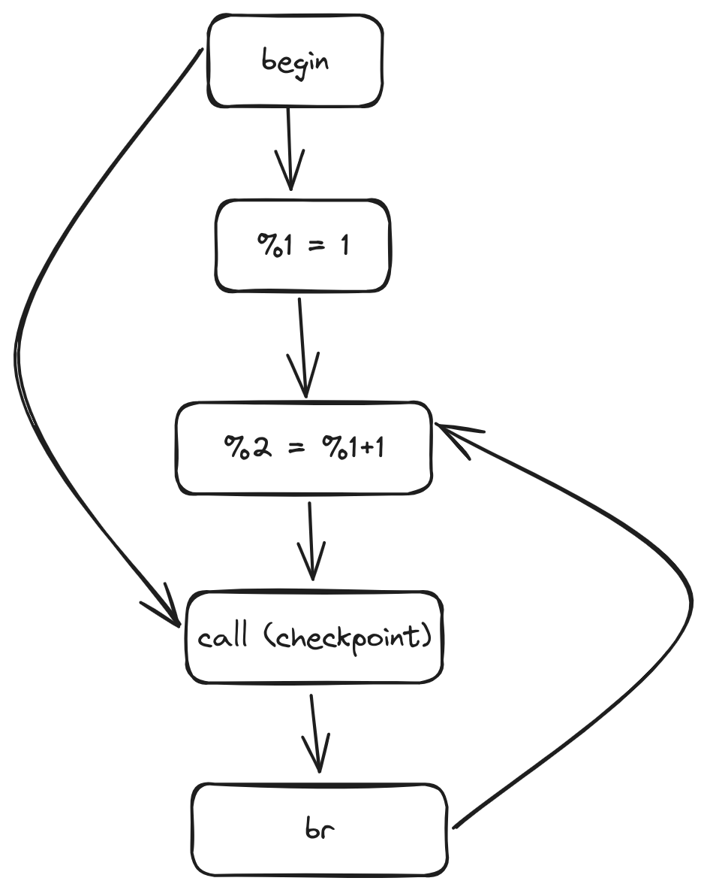

## How AOT is implemented in LLVM
Implement the struct in `OpaqueExecutionEngine`. Compile everything with auxiliary data structure and store in the mmaped file.
1. `Module` is the basic unit of compilation
   1. Optimization
   2. Passes
   3. Dynamic Linking(Von Neumann Architecture)
   4. Auxiliary data structure
2. StandAlone Linker and Loader Relocation for function library

## How JIT is implemented in LLVM
ORCJIT is not a standalone JIT engine and do not have dynamic compilation with program synthesis optimization.
1. Concurrent/Speculative/Eager compilation, compilation on lookup with reexport/linking/indirection support
   1. low compilation overhead 
   2. may be slow first time call
2. Remote execution & debugging support [4]
   1. Good for live migration
   2. not good mapping accross platform 
3. Do not have struct `OpaqueExecutionEngine` and standalone struct update during running.
4. Runtime
   1. Try-Catch
   2. Static Var Init
   3. dlopen
   4. TLS
   5. C ABI
   6. Auto memory management for JITed code
      1. dwarf debug info(refer to julia) []
      2. codecache
## What's the implementation of AOT in WAMR

1. `aot_loader.c` is the main entry point of AOT
2. `aot_runtime.c` gives the runtime export function for AOT that can hook for specific logic exports
3. `aot_compile.c` you can export the logic and output the corresponding calls the runtime function. etc. `aot_alloc_frame` and `aot_free_frame` with `aot_call_indirect` and `aot_call` to call the function with `--aot-dump-frame` on for wamrc option. 
4. `aot_emit_*.c` is the instruction emmitter for every instruction in wasm which literally the same as interpretor but to LLVM backend.
5. checkpoint happens with LLVM passes that insert the `INT3` with `fence` on top of the label. where the wasm stack is stateless of the LLVM state which we can snapshot all the corresponding state to wasm view. Restore happens to make the stateless wasm stack back to the LLVM state. which literally skip the logic that happens before the checkpoint.

## References
1. https://www.bilibili.com/video/BV13a41187NM/?spm_id_from=333.337.search-card.all.click
2. https://dl.acm.org/doi/abs/10.1145/3603165.3607393
3. https://ieeexplore.ieee.org/abstract/document/9912710
4. https://link.springer.com/chapter/10.1007/978-3-319-39077-2_10
5. https://github.com/llvm/llvm-project/trße/main/llvm/examples/OrcV2Examples